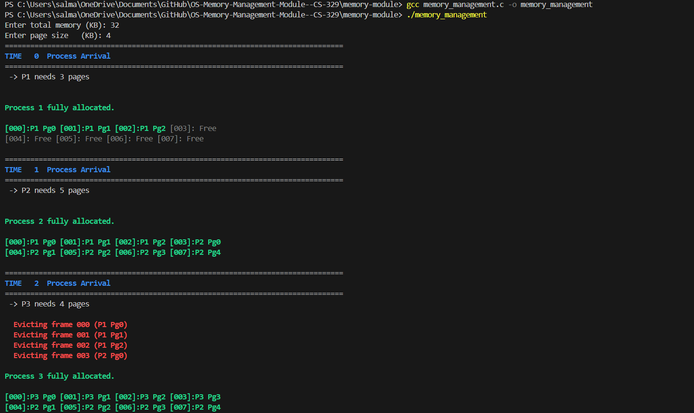
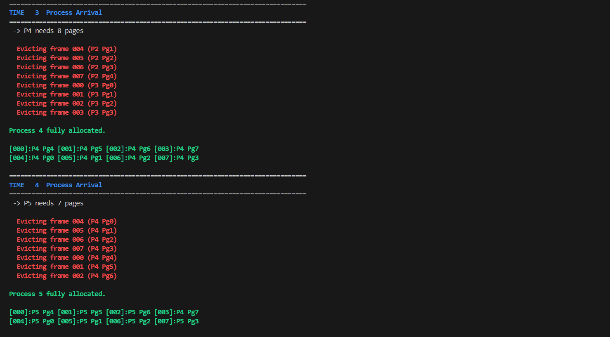
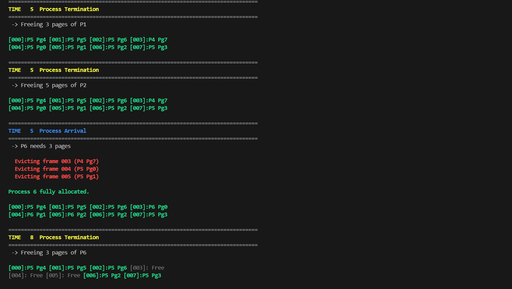

# OS-Memory-Management-Module--CS-329
This project simulates a memory management module for an Operating System using **Fixed Paging Technique**, as part of the CS-329 Operating Systems course.

Group-Members: MahnoorZia | AnooshaKhalid | LaibaIqrar

## Features

- Simulates the paging memory management technique
- Takes process inputs via txt
- Handles memory allocation on process arrival
- Displays current memory state (used and free pages)
- Supports at least 10 input processes

## Paging Technique – Overview

Paging is a memory management scheme that eliminates the need for contiguous allocation of physical memory. It divides both the process and physical memory into fixed-size blocks:

- **Pages**: Fixed-size blocks of a process
- **Frames**: Fixed-size blocks of physical memory

The system maintains a **Page Table** for each process to map its pages to available frames in memory. Paging avoids external fragmentation and allows efficient memory allocation.

## Input Format

Each process must include:

- `Process ID`
- `Arrival Time`
- `Total Size (in KB)`

Input is provided via a `.txt` file named as "process.txt"

## Structure

See `memory-module/` for code, and `processes/` for sample input.

<pre> ``` OS-Memory-Management-CS329/ ├── README.md ├── memory_module/ │ ├── memory_management.c │ └── processes/ │ └── process.txt ├── docs/ │ ├── OEL-Report.pdf │ └── problem-statement.pdf └── readme_images/ ├── image1.png ├── image2.png ├── image3.png └── image4.png ``` </pre>

## Output






## Prerequisites

Before running the program, ensure that you have the necessary setup:

1. Make sure you have `gcc` installed to compile C code.

## Running the C Program

To compile and run the C program:

```bash
gcc memory_management.c -o memory_management
./memory_management


